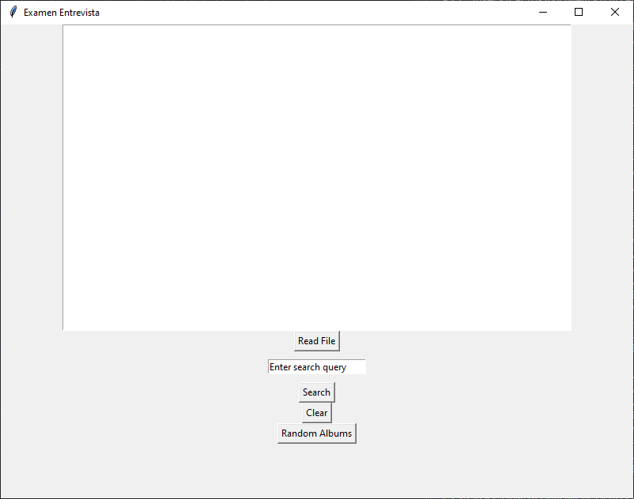
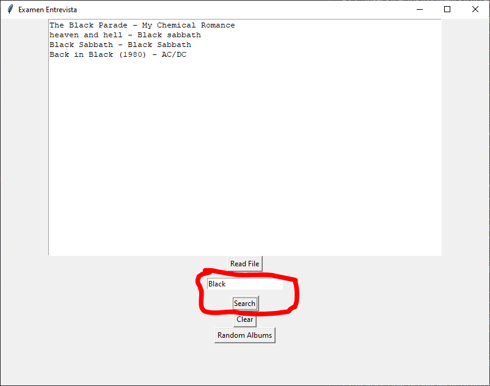

## Consulta de conocimientos

En el presente Repo se encuentra un archivo JSON con una lista de Álbumes, cuenta con artista, `álbum`, `visitado` y `nominado`.

1. **Como primera actividad:** se requiere que se lea dicho documento en el lenguaje y paradigma de su elección y demuestre que los datos fueron leidos.
2. **Como segunda actividad:** Debe de ser posible realizar una búsqueda dentro de esta lista ya sea por nombre del álbum o por artista.
3. **Como actividad Final:** Se requiere que entregue una lista aleatoria de 4 Álbumes con las siguientes características, **no** debe de tomar álbumes `ya visitados`, y en medida de lo posible que tome al menos un álbum `no nominado` si es que aun quedan álbumes `no nominados`, una vez mostrada la lista marcar todos los álbumes mostrados como nominados.

Se proporciona un tiempo de 40min para la solucion de la actividad.

Esta permitido el uso del internet para consulta y para descarga de librerías, se provee una computadora con visual estudio instalado para desarrollo en C#.

Se espera que el producto final de esta actividad sea una aplicación visual pero es completamente aceptable que sea una aplicación de consola.

Debido a limitaciones de tiempo es aceptable que solo se complete parcialmente la actividad, el objetivo es comprender como el individuo aplica la lógica.

## Solucion
Para resolver esta actividad se uso el lenguaje `Python` con las libreria `json` y `Tkinter`. Esta solucion consiste en dos archivos: `examen_controller.py`, el cual se encarga de recuperar la informacion y `examen_view.py`, que se encarga de desplegar la informacion.

## Uso
Requisitos: instalacion de Python `v3`

Para hacer uso de la solucion, ejecuta el archivo `examen_view.py`. Este archivo contiene la aplicacion visual para consultar la informacion de albumes.

Dentro de la aplicacion, haz uso de los botones para leer el archivo .json con la informacion, hacer una busqueda entre artistas y albumes o sugerir una lista de 4 albumes (sin visitar y sin nominar)
.PNG)

Resultados de busqueda
